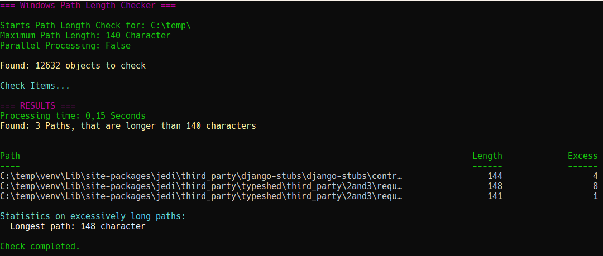

# 📂 Test-PathLength
A PowerShell script that checks directory paths for excessive length and helps maintain the integrity of network shares.

### 🎯 About the Project
---
This project is designed to proactively ensure the integrity of network shares.
It regularly scans all shared directories and identifies paths that exceed the maximum length of 255 characters.
Detected paths are collected and can be exported for further processing.

### 🧰 Features
---
- Scans all paths under a specified root directory
- Supports parallel processing for faster execution
- Allows exporting results as a CSV file

### 📋 Requirements
---
- PowerShell 7
- Script execution must be allowed

### :cd: Installation
---
Permission to access the root path being examined must be granted. 
Script execution must be allowed. The script should not be blocked.

```powershell
# Allow script execution
Set-ExecutionPolicy -Scope CurrentUser -ExecutionPolicy RemoteSigned

# Unblock the script if necessary
Unblock-File Test-PathLengths.ps1
```

### :rocket: Quickstart
---
```powershell
# Checks the path c:\temp sequentially and outputs the result to the shell.
Test-PathLengths.ps1 -Path C:\temp\ -MaxLength 140

# Checks the path c:\temp in parallel and outputs the result to the shell.
Test-PathLengths.ps1 -Path c:\temp -MaxLength 140 -UseParallel

# Checks the path c:\temp sequentially and saves the result as a CSV file in the specified path.
Test-PathLengths.ps1 -Path C:\temp\ -MaxLength 140 -OutputFile .\result.csv
```

### 🖥 Output
The script displays results directly in the PowerShell console.

If ≤ 50 paths are found, they are shown in the shell. <br>
If > 50 paths, a separate grid view window opens for easier navigation.

#### Example output in the console:



### :page_facing_up: License
---
This Project is released under the MIT [./License].